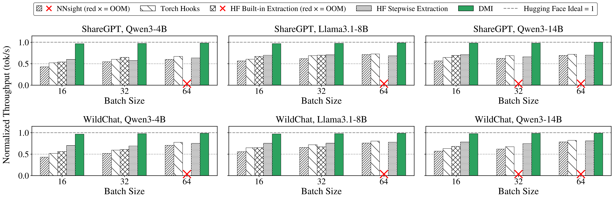
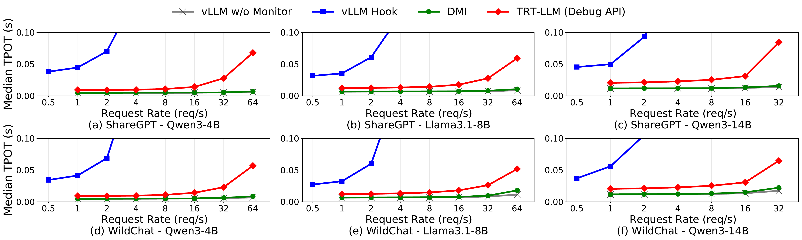

<p align="center">
  
</p>

<h1 align="center">DMI — Deep Model Inspector</h1>

<p align="center">
  <strong>A decoupled, asynchronous observation substrate for high-speed LLM inference.</strong>
</p>

> **Project Status — research preview.** DMI currently supports HuggingFace
> and vLLM backends for Qwen3 / Llama3.1 and GPT-2-family experiments, with Ring² transport
> and optional host-side persistence. APIs may change. Contributions, bug
> reports, and feature requests are welcome.

---

## About

**DMI is an observability layer for LLM inference.** It gives real-time access to
*any* internal model state — residual streams, attention patterns, MLP outputs,
KV-cache slices, logits — during real serving, with minimal overhead and without
forking the inference engine.

DMI works in **HuggingFace Transformers** and **vLLM** out of the box, captures
internal tensors through CUDA-Graph–compatible hooks, and streams them off the
GPU via a dedicated ring buffer to a host-side drain that pushes into a
queryable store (or drops them, for transport-only profiling).

## Why DMI

If you're:

- debugging hallucinations and model bugs in production,
- studying interpretability, activation steering, or refusal behavior,
- building speculative-decoding drafts that consume the target model's internals,
- mining distillation datasets from hidden states,
- or monitoring attention collapse during long generation,

you need internal visibility **without rewriting your model or slowing inference 10×**.
That's the gap DMI fills.

## Key features

- **`HookPoint`** — drop-in observation primitive. Place it anywhere in a PyTorch
  model; works under CUDA Graphs and survives `torch.compile`.
- **`Ring²`** — GPU↔CPU co-designed staging. A dedicated GPU-side payload ring
  isolates captured tensors from the KV-cache memory pool; an on-host meta ring
  is drained asynchronously.
- **HF + vLLM integration** — no engine fork required by the user. Plug in
  through a worker class (vLLM) or a thin generation wrapper (HF).
- **Configurable offloading** — capture your hidden states on GPU, stage on host,
  and stream into a queryable store; visualize from notebooks (check out the [Demo](#demo) below).
- **Quantified overhead** — measured against vanilla HF, HF's `output_hidden_states`,
  and `register_forward_hook`. See [benchmarks](docs/benchmarks.md).

## Demo                                         
                  
Captured internals explored in a Jupyter notebook -- attention patterns, residual-stream norms, per-token confidence, and top-k alternatives over one prompt through Qwen3-0.6B.  
Source under [`example/visualization/`](example/visualization/README.md).  


https://github.com/user-attachments/assets/df68bb06-d575-43e3-aed8-b08ca587e81a


## Performance

**Offline throughput** — Qwen3-4B / Llama-3.1-8B / Qwen3-14B on ShareGPT and
WildChat, normalized to vanilla HuggingFace (ideal, no observation = 1.0).
Red × = out of memory.

<p align="center">
  
</p>

**Online serving (TPOT)** — same models on vLLM, plotted against request rate.
DMI tracks the no-monitor baseline; synchronous hook/debug baselines saturate
at much lower request rates.

<p align="center">
  
</p>

Full setup, additional results, and how to reproduce:
[`docs/benchmarks.md`](docs/benchmarks.md).

## Get started

Start with the [installation guide](docs/install.md), then choose the
HuggingFace or vLLM path depending on the runtime you want to inspect. The
snippet below shows the minimal vLLM entry point.

```python
import os
# Required for the current effectful-op integration with vLLM
os.environ["VLLM_DISABLE_COMPILE_CACHE"] = "1"

from vllm import LLM, SamplingParams

llm = LLM(
    model="Qwen/Qwen3-0.6B",
    worker_cls="integration.vllm_adapter.DMXGPUWorker",
    additional_config={
        "dmx_hook_selection": "vllm-full",
        "dmx_null_mode": True,   # capture + transport, drop on host (no DB needed)
    },
)

for o in llm.generate(["The answer is"], SamplingParams(max_tokens=16)):
    print(o.outputs[0].text)
# Internal states for every layer have been captured into Ring²
# during the run. Set "dmx_null_mode": False and configure a sink
# to persist them.
```

| | |
|---|---|
| **[HuggingFace](docs/huggingface.md)** | Run HF generation, monitored generation, and offline benchmark scripts |
| **[vLLM](docs/vllm.md)** | Run DMI through the vLLM offline API or `vllm serve` |

## Contribute

DMI is an early research system from FrootLab at the University of Maryland, and
we welcome contributions from users, researchers, and systems builders. Useful
contributions include bug reports, documentation fixes, benchmark reproduction
notes, new model integrations, and backend-specific improvements for
HuggingFace or vLLM.

- **Questions, bugs, and feature requests.** Please open a GitHub issue with the
  model, backend, hardware, and reproduction steps when applicable.
- **Code and documentation.** Pull requests are welcome. For larger changes,
  open an issue first so we can align on scope and avoid duplicated work.
- **Model and backend support.** We are especially interested in additional model
  families and serving backends, and welcome collaborations with other inference
  backends or projects.
- **Contact.** For collaborations or project-level discussions, reach out through
  GitHub issues or contact the maintainers through the ProjectDMX organization.

## Citation

```bibtex
% Coming soon.
```

## License

DMI is licensed under the Apache License 2.0. See the [LICENSE](LICENSE) file for details.
