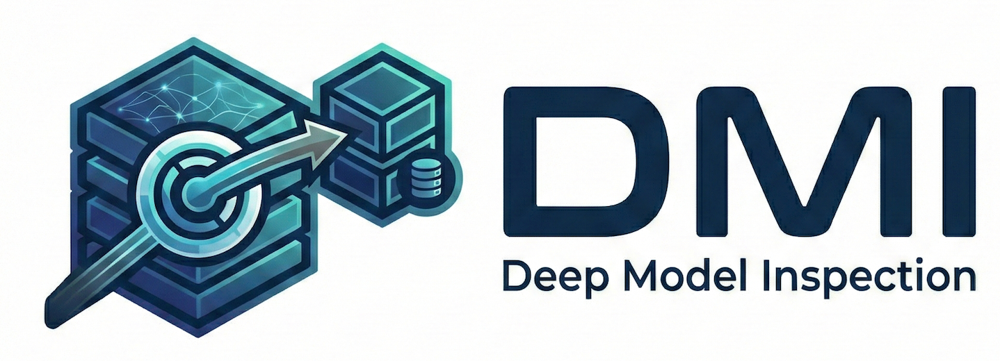

<!--
New open-source style intro (DMI) is added below.
Original README content is preserved and kept after the new sections.
-->

<!-- # DMI (Deep Model Inspection) -->

<p align="center">
  
</p>

<p align="center">
  <strong>Built for real-time visibility into LLM inference</strong>
</p>

**Project-DMI** is an open-source LLM monitoring toolkit for LLM inference.  
It helps you inspect any internal model states (activations, attention, logits, KV cache) during real LLM inference, with a high-performance C++ backend and async data pipeline.

## About

DMI is built for engineers and researchers who need to understand what happens *inside* a model while it runs. DMI includes **Shadow Block**, a unique GPU-resident hook system for CUDA-Graph-friendly monitored inference at high speed.

Instead of only looking at final outputs or manually adding hooks, DMI lets you:
- **Attach** hook points to internal layers wherever you want,
- **Fast capture** internal states with minimal inference interruption,
- **Persist** the data to DB (Disk/In-memory) for large-scale analysis with **Visualization**.

The goal is practical model debugging and inspection with minimal overhead.

## Key Features

- 🔍 **Deep Internal Inspection**: Capture any internal model states as you want.
- ⚙️ **Configurable Capture Control**: Per-step and per-request sampling with flexible hook selection.
- ⚡ **GPU-Resident Hook System***: We introduced **Shadow Block**, a system-level kernel innovation for CUDA-Graph-friendly monitored inference at high speed.
- 🚀 **Fast Monitoring Engine for Data Transfer**: C++-powered, high-throughput data movement for inference-time capture.
- 🗄️ **Host Engine for Persistence & Visualization**: Built-in database pipeline to persist captured data, with ready-to-inspect visualization dashboards.
- 🧩 **Seamless Hugging Face API Integration**: Works with familiar HF `generate` APIs and natively supports HF parallel inference strategies (e.g., TP/PP workflows).

\* In active integration; this direction is included as part of DMI's core roadmap.

## Installation

### 1) Clone repository + submodules

```bash
git clone --recursive <your-repo-url>
cd HF_Prometheus

# If already cloned without --recursive
git submodule update --init --recursive
```

Current required submodules in this repo:
- `transformers/`
- `libs/clickhouse-cpp/`

### 2) Create Python environment

```bash
conda env create -f environment.yml
conda activate proj-dmx
```

### 3) Install Python packages

```bash
pip install -e .
pip install -e transformers/
```

### 4) Build native dependencies

Build ClickHouse C++ client (required by the monitoring extension link stage):

```bash
cmake -S libs/clickhouse-cpp -B libs/clickhouse-cpp/build -DCMAKE_BUILD_TYPE=Release
cmake --build libs/clickhouse-cpp/build -j
```

Build DMI native backend:

```bash
make -C monitoring -j
# or simply: make
```

## Quick Start

Supported model architectures (current):
- `gpt2`
- `qwen3`

We provide runnable example scripts in `benchmark/scripts/`:

- `benchmark/scripts/hf_generate.py` (HF baseline inference)
- `benchmark/scripts/hf_monitoring_generate.py` (DMI monitored inference)


Example runs:

```bash
python benchmark/scripts/hf_generate.py --model gpt2 --device cuda --batch-size 8 --max-new-tokens 16
python benchmark/scripts/hf_monitoring_generate.py --model qwen3 --device cuda --batch-size 8 --max-new-tokens 16 --no-db
```

---

<!-- Original README starts here (preserved) -->

<!-- # Proj-dmx (Huggineface/transformers)

**Prototype of Proj-dmx on HF/transformers library.** A white-box observability system for LLM inference. Capture and analyze internal model states (activations, attention weights, KV cache) with minimal performance overhead.

## Features

- **Internal State Monitoring**: Capture activations, attention patterns, and KV cache statistics during inference
- **Configurable Sampling**: Control capture frequency with step-level and request-level scheduling
- **Async Pipeline**: Non-blocking GPU→CPU transfer with pinned memory pools
- **Native C++ Backend**: High-performance hook callbacks with Python/C++ hybrid architecture
- **TransformerLens-style API**: Familiar `run_with_cache` interface for activation collection

## Architecture

```
┌──────────────────────────────────────────────────┐
│  HookedGPT2Model (modified transformers)         │
│  └── HookPoints → trigger callbacks              │
└─────────────────────┬────────────────────────────┘
                      ↓
┌──────────────────────────────────────────────────┐
│  MonitoringEngine                                │
│  ├── CaptureSchedule (token/request sampling)    │
│  ├── HookSelection (hooks sampling)              │
│  └── Native Backend routing                      │
└─────────────────────┬────────────────────────────┘
                      ↓
┌──────────────────────────────────────────────────┐
│  C++ Native Backend                              │
│  ├── Async GPU→CPU transfer                      │
│  ├── Pinned memory management                    │
│  └── Lock-free task queue                        │
└──────────────────────────────────────────────────┘
```


## Project Structure

```
HF_Prometheus/
├── monitoring/
│   ├── __init__.py
│   ├── engine.py          # MonitoringEngine
│   ├── config.py          # Configuration classes
│   ├── task.py            # Task definitions
│   └── csrc/              # C++ native backend
│       ├── native_engine.cpp
│       ├── hooks.cpp
│       └── ...
├── transformers/          # Git submodule (forked)
│   └── src/transformers/models/gpt2_p/
│       ├── modeling_gpt2.py   # HookedGPT2Model
│       └── hook_points.py     # HookPoint implementation
├── benchmark/
│   └── tests/             # Performance benchmarks
├── example/               # User-facing examples
└── tests/                 # Unit tests
```


## Installation

```bash
# Clone with submodules
git clone --recursive git@github.com:Samfisheryu/vLLM-Prometheus.git
cd vLLM-Prometheus

# If already cloned without --recursive
git submodule update --init --recursive

# Ensure nested submodules inside dmx_host are present (clickhouse-cpp)
git -C dmx_host submodule update --init --recursive
```

### Option 1: Conda (Recommended)

```bash
conda env create -f environment.yml
conda activate proj-dmx
pip install -e transformers/  # Install local modified transformers
pip install -e dmx_host/      # Builds clickhouse_client extension
```

### Option 2: Pip

```bash
pip install -r requirements.txt
pip install -e transformers/  # Install local modified transformers
pip install -e dmx_host/      # Builds clickhouse_client extension
```

### Build C++ Extension

```bash
cd monitoring && make
```


## Quick Start

**Notebook:** [Quick_Start.ipynb](./Quick_Start.ipynb)

### Example: Minimal monitoring (CPU)
```bash
python -m example.gpt2_generate_with_monitoring
```
### Example: CUDA + ClickHouse pipeline
Requires running ClickHouse and the dmx_host extension built.
```bash
python -m example.gpt2_generate_with_monitoring_db
```

#### ClickHouse quick check
```bash
clickhouse-client --query "SELECT 1"
```

Optional DB overrides:
`DMX_DB_HOST`, `DMX_DB_PORT`, `DMX_DB_USER`, `DMX_DB_PASSWORD`,
`DMX_DB_DATABASE`, `DMX_DB_TABLE`.


## Run Benchmark

## Benchmark Runtime Config

- Runtime env toggles under `MON_NATIVE_*` are removed.
- Use `MonitoringConfig` for runtime tuning (`advance.*`) and debug behavior (`debug`).
- For benchmark scripts that expose it, use `--nvtx` to enable debug/NVTX (`MonitoringConfig.debug=True`).

### Args
```bash
steps: requests
warmup: warmup requests
decode-steps: decode token length
```

### profile_decode.py - Comprehensive Comparison

Compares multiple inference approaches (TransformerLens, HuggingFace, HookedGPT2Model) with profiling support:


# Basic run
python -m benchmark.tests.profile_decode_qwen3 --batch-size 1 --steps 1 --warmup 1 --collect-hidden --collect-attention --no-profile --dtype fp16

# With nsight profiling
nsys profile --output=your_results_path/xxx --force-overwrite=true --trace=cuda,nvtx,osrt --sample=cpu --sampling-period=1000000 --cpuctxsw=process-tree --cuda-memory-usage=false python -m benchmark.tests.profile_decode --profile-dir your_results_dir/xxx --batch-size 64 --decode-steps 64 --collect-hidden --collect-attention --steps 1 --warmup 1 --no-profile --nvtx

**Tested configurations:**
- `transformer_lens` / `transformer_lens_cache` - Original TransformerLens
- `huggingface` / `huggingface_api` - Pure HuggingFace
- `hf_modified` / `hf_modified_hook` / `hf_modified_hook_async` - HookedGPT2Model with MonitoringEngine

### hf_modified_async_config_benchmark.py - Config Validation

Tests different MonitoringConfig settings (full capture vs sampled):

```bash
python benchmark/tests/hf_modified_async_config_benchmark.py --batch-size 64 --steps 1 --warmup 1 --decode-steps 64 --collect-hidden --collect-attention
```

### hf_modified_async_config_token_stride_benchmark.py - Token Stride Impact

Measures performance impact of different `step_stride` values:

```bash
python benchmark/tests/hf_modified_async_config_token_stride_benchmark.py --batch-size 64 --steps 1 --warmup 1 --decode-steps 64 --collect-hidden --collect-attention
```

Tests strides: `[1, 10, 30, 400]` - higher stride = fewer captures = faster

### hf_modified_async_config_request_stride_benchmark.py - Request Stride Impact

Measures performance impact of different `request_stride` values:

```bash
python benchmark/tests/hf_modified_async_config_request_stride_benchmark.py --batch-size 64 --steps 10 --warmup 1 --decode-steps 64 --collect-hidden --collect-attention --no-profile
```

Tests strides: `[1, 2, 5, 100]` - higher stride = skip more requests -->
