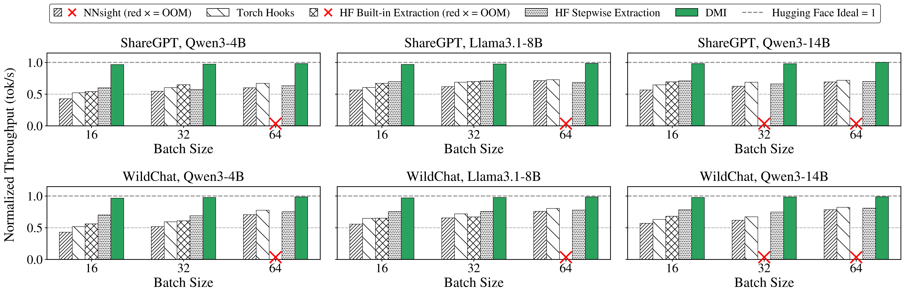
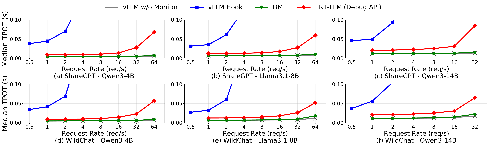

<p align="center">
  
</p>

<h1 align="center">DMI — Deep Model Inspection</h1>

<p align="center">
  <strong>A decoupled, asynchronous AI-native data observation backend for high-speed LLM inference.</strong>
</p>

> [!IMPORTANT]
> **Seeking Research and Dev. Collaborations.** We are actively looking for research
> collaborators to explore downstream applications built on DMI such as **interpretability**, **speculative decoding**,
> **hallucination analysis**, **distillation**, **activation steering**, and beyond. If you're interested, please [contact us](mailto:ynn1999@umd.edu,sixianx@umd.edu,zaoxing@umd.edu).

> **Project Status — research preview.** DMI currently supports HuggingFace
> and vLLM inference for Qwen3 / Llama3.1 and GPT-2-family, plus Megatron-LM
> training. SGLang support is on the way. APIs may change.
> Contributions, bug reports, and feature requests are welcome.

> **👀Technical Report Available:** https://arxiv.org/abs/2605.11093

---
## Roadmap

We are working to make DMI useful across more backends, more models, and more
stages of the model lifecycle.

- **More backend support and models** — Bring DMI to **SGLang** and expand support for
  more widely used model families, including multimodal models.
- **From observation to action** — Low-latency streaming/pluggable APIs enables more downstream applications like online monitoring, activation steering,
    distillation, and speculative decoding.
- **Broader PCIe-aware scheduling** — Extend DMI's serving-first drain governor
  to more KV connectors, multi-rank topologies, and other serving traffic.


## About

**DMI is a full-feature observability layer for LLM inference and training.** It gives real-time access to
*any* internal model state — residual streams, attention patterns, MLP outputs,
KV-cache slices, logits — during inference or training, with minimal overhead.

Right now, DMI supports inference through **HuggingFace Transformers** and
**vLLM**, and training through **Megatron-LM**. It captures
internal tensors through CUDA-Graph–compatible hooks and streams them off the
GPU via a dedicated ring buffer to a host-side drain that pushes into a
queryable store (or drops them, for transport-only profiling).

## Why DMI

If you're:

- debugging hallucinations and model bugs in production,
- studying interpretability, activation steering, or refusal behavior,
- building speculative-decoding drafts that consume the target model's internals,
- mining distillation datasets from hidden states,
- or monitoring attention collapse during long generation,

you need internal visibility **without rewriting your model or slowing inference 10×**.
That's the gap DMI fills.

## Key features

- **`HookPoint`** — drop-in observation primitive. Place it anywhere in a PyTorch
  model; works under CUDA Graphs and survives `torch.compile`.
- **`Ring²`** — GPU↔CPU co-designed staging. A dedicated GPU-side payload ring
  isolates captured tensors from the KV-cache memory pool; an on-host meta ring
  is drained asynchronously.
- **HF, vLLM, and Megatron-LM integrations** — use a thin generation wrapper
  for HF, a worker integration for an unmodified official vLLM installation,
  or the version-matched Megatron-LM training integration.
- **Configurable offloading** — capture your hidden states on GPU, stage on host,
  and stream into a queryable store; visualize from notebooks (check out the [Demo](#demo) below).
- **Quantified overhead** — measured against vanilla HF, HF's `output_hidden_states`,
  and `register_forward_hook`. See [benchmarks](docs/benchmarks.md).

## Demo                                         
                  
Captured internals explored in a Jupyter notebook -- attention patterns, residual-stream norms, per-token confidence, and top-k alternatives over one prompt through Qwen3-0.6B.  
Source under [`examples/visualization/`](examples/visualization/README.md).


https://github.com/user-attachments/assets/7aaf73ce-a0e4-4953-ba99-dd78dd36ca52


## Performance

> [!NOTE]
> **New: DMI vs. vLLM Hidden State Extraction.** vLLM recently added a native
> way to save hidden states. We benchmarked it against DMI on Qwen3-4B prefill:
> DMI captures about **13× more tensor data per token** while keeping extraction
> overhead **15–17× lower** at batch sizes 16–32 in a matched extraction-only
> setup. Read the full comparison:
> [`docs/dmi_vllm_ehs/dmi-vs-ehs.md`](docs/dmi_vllm_ehs/dmi-vs-ehs.md).

**Offline throughput** — Qwen3-4B / Llama-3.1-8B / Qwen3-14B on ShareGPT and
WildChat, normalized to vanilla HuggingFace (ideal, no observation = 1.0).
Red × = out of memory.

<p align="center">
  
</p>

**Online serving (TPOT)** — same models on vLLM, plotted against request rate.
DMI tracks the no-monitor baseline; synchronous hook/debug baselines saturate
at much lower request rates.

<p align="center">
  
</p>

Full setup, additional results, and how to reproduce:
[`docs/benchmarks.md`](docs/benchmarks.md).

## Get started

Start with the [core installation guide](docs/install.md), then choose the
HuggingFace, vLLM, or Megatron-LM path depending on the runtime you want to
inspect. The project currently supports installation from source. Use a
separate environment and checkout for each backend, and install only the
integration you need. The snippet below shows the minimal vLLM entry point. The
version-matched integration checkout connects DMI to an unmodified official
vLLM installation.

```python
import os
# Required for the current vLLM integration
os.environ["VLLM_USE_V2_MODEL_RUNNER"] = "0"

from vllm import LLM, SamplingParams

llm = LLM(
    model="Qwen/Qwen3-0.6B",
    worker_cls="dmi_vllm_integration.worker.DMXGPUWorker",
    additional_config={
        "dmx_hook_selection": "vllm-full",
        "dmx_null_mode": False,
        "dmx_db_host": "",       # active capture + transport; no persistence
    },
)

for o in llm.generate(["The answer is"], SamplingParams(max_tokens=16)):
    print(o.outputs[0].text)
# Internal states for every layer have traversed Ring² during the run.
# Configure a sink to persist them. Setting "dmx_null_mode": True
# disables DMI planning, metadata, and payload copying.
```

| | |
|---|---|
| **[Core installation](docs/install.md)** | Install DMI from source and build the native backend |
| **[HuggingFace](docs/huggingface.md)** | Run HF generation, monitored generation, and offline benchmark scripts |
| **[vLLM](docs/vllm.md)** | Run DMI through the vLLM offline API or `vllm serve` |
| **[Megatron-LM](docs/megatron.md)** | Run DMI during Megatron-LM training |

## Contribute

DMI is an early research system from FrootLab at the University of Maryland, and
we welcome contributions from users, researchers, and systems builders. Useful
contributions include bug reports, documentation fixes, benchmark reproduction
notes, new model integrations, and backend-specific improvements for
HuggingFace, vLLM, or Megatron-LM.

- **Questions, bugs, and feature requests.** Please open a GitHub issue with the
  model, backend, hardware, and reproduction steps when applicable.
- **Code and documentation.** Pull requests are welcome. For larger changes,
  open an issue first so we can align on scope and avoid duplicated work. See
  the [code-organization guide](docs/code-organization.md) for package
  boundaries and compatibility expectations.
- **Model and backend support.** We are especially interested in additional model
  families and serving backends, and welcome collaborations with other inference
  backends or projects.
- **Contact.** For collaborations or project-level discussions, reach out through
  GitHub issues or contact the maintainers through the ProjectDMX organization.

## Citation

```bibtex
@misc{yu2026enablingperformantflexiblemodelinternal,
      title={Enabling Performant and Flexible Model-Internal Observability for LLM Inference}, 
      author={Nengneng Yu and Sixian Xiong and Yibo Zhao and Wei Wang and Zaoxing Liu},
      year={2026},
      eprint={2605.11093},
      archivePrefix={arXiv},
      primaryClass={cs.LG},
      url={https://arxiv.org/abs/2605.11093}, 
}
```

## License

DMI is licensed under the Apache License 2.0. See the [LICENSE](LICENSE) file for details.
