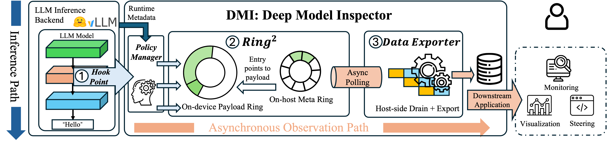
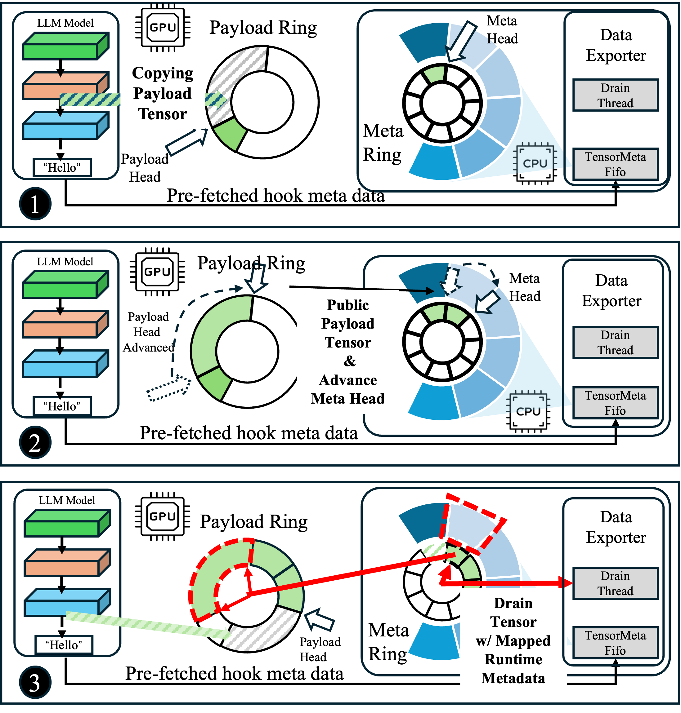

# Architecture

DMI is a decoupled, asynchronous observation substrate that runs alongside the
inference hot path. It captures internal model states (residual streams, attention
patterns, MLP outputs, KV-cache slices, logits, …) without modifying the inference
engine's backbone and without breaking CUDA Graph replay or KV-cache memory reuse.

  

The system has three layers:

1. **`HookPoint`** — where data is captured (inside the model graph).
2. **`Ring²`** — how data is staged off the hot path (GPU-side payload ring +
   on-host metadata ring).
3. **Async host backend** — how data is drained, persisted, and exposed to
   downstream consumers.

---

## 1. HookPoint — the capture primitive

A `HookPoint` is a lightweight `nn.Module` that can be inserted at arbitrary
locations in a PyTorch model — Q/K/V projections, residual stream, MLP output,
attention pattern, logits, KV-cache slices. It is:

- **CUDA-Graph compatible.** A custom CUDA op underneath the HookPoint emits a
  graph node that copies the hooked tensor into the Ring² payload buffer. The
  inference graph stays static and replay-safe.
- **Backend-agnostic.** Works in HuggingFace Transformers and vLLM with the
  same API. Each model declares its observation sites via a `HookSpec`, so
  the transport layer knows the metadata template (shape, dtype, slot id)
  for one forward pass.
- **Selectable at runtime.** Hook selection (`full`, `hf-only`, `hidden-states`,
  `logits`, …) controls which sites emit data, without recompiling the model.
  Individual hook short names (e.g. `q`, `k`, `v`, `attn_scores`, `pattern`,
  `mlp_post`) can also be combined.

Engine integration is intentionally thin: for vLLM, DMI subclasses `Worker` to
install hooks before CUDA-Graph capture; for HuggingFace, it wraps
`prepare_inputs_for_generation`. The framework's backbone code is untouched.

---

## 2. Ring² — GPU↔CPU staging

  

The challenge: high-performance serving stacks reuse GPU memory aggressively
(KV cache, batching pools). Naively retaining captured tensors collides with
that reuse. Ring² solves this with a **GPU–CPU co-designed** double-ring layout:

- **On-device payload ring** — a dedicated GPU buffer for tensor payloads,
  isolated from the KV-cache pool. The HookPoint kernel writes directly here.
- **On-host meta ring** — a CPU-preferred managed-memory ring of fixed-size
  descriptors, paired with a pre-pushed host-side `TensorMetaFIFO` of runtime
  metadata (request IDs, shapes, dtypes); drained asynchronously by the host.

Because the payload ring is allocated outside the inference memory pool, captured
tensors do not extend the lifetime of activations the engine wants to free, and
do not reduce serving capacity. Because the producer is a graph node, the entire
capture path runs inside the replayable execution graph.

---

## 3. Async host backend

A drain thread on the host wakes on producer notifications (or a configurable
poll timeout), copies ready payloads out of the GPU payload ring into a
pinned host staging buffer, and hands them to a p2p thread that submits to
the host engine — a single-stage ClickHouse insert pipeline (`DMXHostEngine`).

A runtime `dmx_null_mode=True` switch short-circuits the p2p submit step:
payloads still flow GPU → ring → drain → staging, but nothing is inserted.
This is useful for isolating transport overhead independently of ClickHouse.

The drain pipeline is independent of the inference loop: backpressure on the
sink does not block the GPU producer as long as the rings are sized for the
workload. Sizing knobs (`dmx_ring_payload_mb`, `dmx_ring_pinned_mb`) are
exposed through `additional_config` for vLLM and CLI flags for the HF
benchmarks.

---

## Why this preserves serving performance

- **Static graph stays static.** The capture op is a graph node, not a Python
  callback, so CUDA-Graph replay is preserved.
- **Memory contracts intact.** Captured tensors live in the dedicated payload
  ring, not the KV-cache pool. Inference batch capacity is unaffected.
- **Host work decoupled.** Serialization, sink I/O, and any post-processing
  happen on the drain thread — the GPU only writes to a ring buffer.

End-to-end measured overhead and comparisons against `register_forward_hook`,
HF's `output_hidden_states`, and TransformerLens-style instrumentation are in
[`benchmarks.md`](benchmarks.md).
