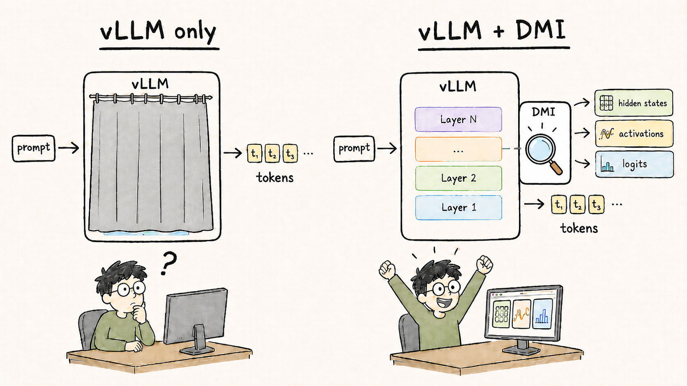

# Doing Internal-State Research on vLLM? DMI Now Gives You the Tensors

Many researchers want to use vLLM as their inference engine, but their actual
research question needs more than generated tokens. If you are studying
reasoning, hallucination, activation probes, speculative decoding, or model
debugging, you often need the model's internal states during generation.

That has been the missing piece: vLLM is fast and widely used, but getting
internal tensors out of the optimized inference path is hard. A quick search of
vLLM's issue tracker turns up dozens of direct requests around hidden-state
extraction and intermediate activation dumps, plus RFCs discussing how to return
those tensors without breaking the serving path.

DMI fills that gap. It lets you keep vLLM as the execution engine and collect
the internal states your research needs, without rebuilding the experiment in a
separate PyTorch script or carrying a fragile local patch.

What this gives you:

- **Model internals during vLLM execution.** DMI can capture residual streams,
  attention projections, MLP activations, layer-norm tensors, token IDs, and
  logits from a running vLLM model.

- **A research path that stays close to serving.** Your experiment runs through
  vLLM's inference stack, so the captured data comes from the system you are
  trying to understand.

- **Less plumbing before the actual idea.** DMI handles the capture mechanism,
  so the research code can focus on what to measure, compare, or train.

Our goal is simple: DMI turns internal-state access on vLLM (and even other
backends!) from a missing capability into something possible.

Check the vLLM usage guide in [`../vllm.md`](../vllm.md).

Related vLLM discussions: [returning prompt hidden states](https://github.com/vllm-project/vllm/issues/24288),
[hidden-state extraction](https://github.com/vllm-project/vllm/issues/33118),
[intermediate activations for reasoning metrics](https://github.com/vllm-project/vllm/issues/37073),
and [debug tensor dumps](https://github.com/vllm-project/vllm/issues/36502).
