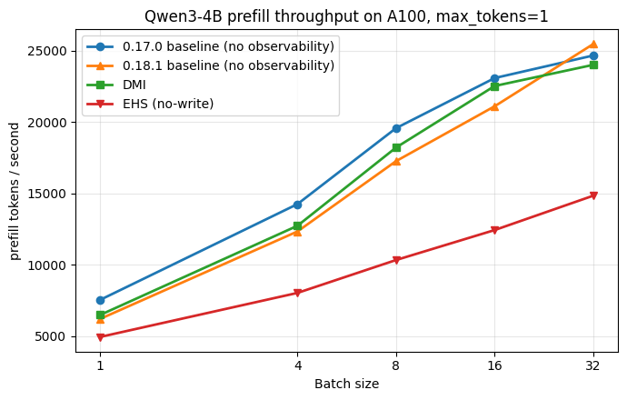
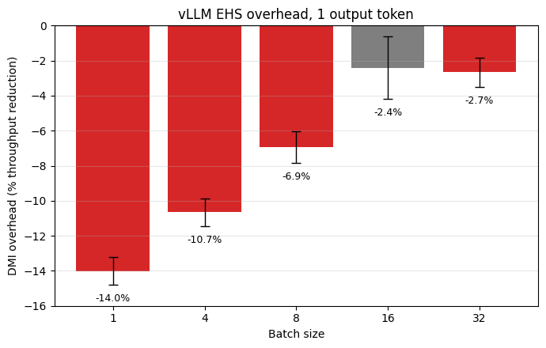
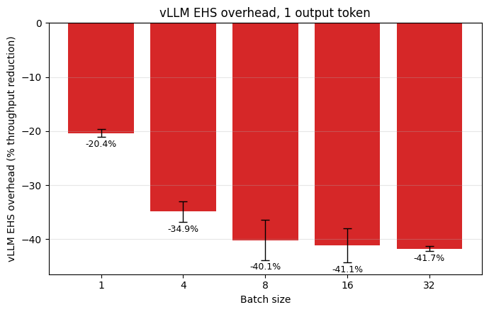
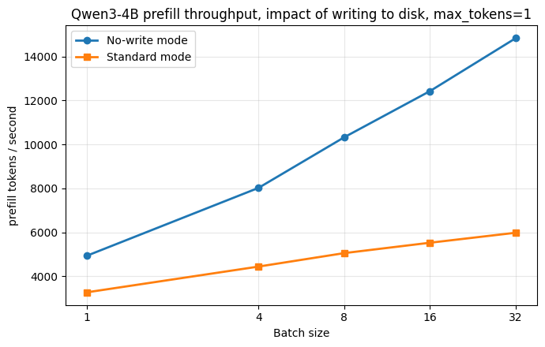

# Inside the model: comparing DMI and vLLM's Extract Hidden States

*From DMI Team: Special thanks to two brilliant UMD undergrads, Jalal Ahmad and Fahran Bajaj, for the detailed benchmark.*

*A look at two recent systems for pulling internal tensors out of a running LLM, and what the performance gap looks like in practice.*

## Summary

- We benchmarked **DMI** against vLLM's **Extract Hidden States** feature (PR #33736, in vLLM ≥0.18) on Qwen3-4B running on a single NVIDIA A100.
- At a typical production batch size (≥16), **DMI adds only 2–3% prefill overhead** while capturing roughly **13× more tensor data per token** than EHS in the matched configuration.
- EHS as shipped costs **47–77% of prefill throughput** depending on batch size. About half of that gap is the synchronous safetensors disk write; the other half is the dummy-draft-model machinery itself.

## Why we ran this

A lot of modern LLM work needs more than the model's output text: drafter training for speculative decoding, mechanistic interpretability, hallucination detection, activation probes. All of those need access to *internal* tensors during inference. Stock PyTorch hooks weren't built for production serving (they trigger host-side synchronization that fights compiler-driven graph optimizations), and engine-specific debug flags like Hugging Face's `output_hidden_states` are tied to one runtime and don't port across stacks.

DMI and EHS attack the problem from opposite directions:

- **DMI** is a purpose-built observability substrate. Forked model code has `HookPoint` modules at residual-stream / Q/K/V / MLP / layer-norm boundaries, and captured tensors flow through an asynchronous GPU↔CPU ring buffer ("Ring²") to a configurable backend (ClickHouse by default). Critically, each `HookPoint` dispatches to a custom CUDA operator that copies the tensor device-to-device into the ring buffer, so capture stays inside the GPU graph and the forward pass never has to wait on a host-side Python callback.
- **EHS** reuses vLLM's speculative-decoding plumbing. It registers a "dummy draft model" whose KV cache is wired to receive verifier hidden states; a custom `KVConnector` drains that cache to disk as safetensors. EHS was built for a specific job: dumping training data for EAGLE-style draft models.

The two aren't really aimed at the same problem. DMI is a general observability tool, EHS targets one narrow workflow, but they're the two most recent attempts at internal-state extraction in a vLLM-served setting, and people building on top of vLLM will reasonably ask which to reach for.

## What each system captures

**DMI's `vllm-full` preset** captures around 12 hook types per layer (residual stream at three positions, Q/K/V/Z, attention output, MLP in/out, layer-norm in/out) plus a handful of top-level hooks (embed, final-LN, token-ids, logits). For Qwen3-4B (36 layers, `hidden_size=2560`), that's **~438 hook firings per forward pass** and **~1.3M captured elements per token**. Tensor sizes vary: residual and LN tensors are `hidden_size=2560`, Q/Z and K/V projections are 4096/1024, and the largest MLP activation reaches `intermediate_size=9728`.

FlashAttention's fused kernel never materializes the `attn_scores`/`pattern` tensors, so even `vllm-full` skips those, a hard limit any vLLM-based capture system inherits.

**EHS** captures hidden states only, one tensor type, at a user-chosen list of layers. In our runs we configured all 37 layer positions (`eagle_aux_hidden_state_layer_ids = [0, 1, ..., 36]`), giving 37 hidden-state tensors per request at `hidden_size=2560`, or **~95k elements per token**.

That's about a **13× difference in captured data per token** under the matched configuration.

*Prefill throughput of DMI null-mode, EHS no-write, and their respective vanilla baselines across batch sizes. DMI captures roughly 13× more data per token than EHS while running substantially faster.*

## What the throughput looks like

We ran both systems through a ShareGPT prompt sweep at batch sizes {1, 4, 8, 16, 32}, with `max_tokens=1` to keep things apples-to-apples (EHS only captures hidden states for prompt tokens, so longer generations would unfairly favor it). Four trials per configuration, single NVIDIA A100, Qwen3-4B, `--cpus-per-task=16`, 64 GB CPU memory.

For a fair head-to-head we ran a custom no-op `KVConnector` on the EHS side so the disk write is out of the picture, matching DMI's `dmx_null_mode=True` configuration. Neither system is paying any storage cost in these rows.

**DMI overhead vs. vanilla vLLM 0.17** (n=4 trials per cell, mean prefill throughput in tokens/sec):

| Batch size | Vanilla 0.17 | DMI null-mode | Overhead |
|---:|---:|---:|---:|
| 1  | 7,541  | 6,485  | −14.0% |
| 4  | 14,243 | 12,725 | −10.7% |
| 8  | 19,561 | 18,204 | −6.9%  |
| 16 | 23,069 | 22,513 | **−2.4%** |
| 32 | 24,650 | 23,995 | **−2.7%** |

**EHS overhead vs. vanilla vLLM 0.18.1** (same protocol, no-write variant):

| Batch size | Vanilla 0.18.1 | EHS no-write | Overhead |
|---:|---:|---:|---:|
| 1  | 6,209  | 4,944  | −20.4% |
| 4  | 12,326 | 8,026  | −34.9% |
| 8  | 17,252 | 10,327 | −40.1% |
| 16 | 21,093 | 12,426 | **−41.1%** |
| 32 | 25,451 | 14,833 | **−41.7%** |

DMI's overhead drops with batch size and is basically gone by bs=16. The asynchronous ring transport overlaps with compute, so per-step fixed costs get amortized as the batch grows. EHS plateaus around 40% overhead instead. Head-to-head at bs=32, DMI throughput is **1.62× higher than EHS** in this matched no-disk configuration, and DMI is capturing ~13× more data per token while doing it.

*Prefill throughput reduction incurred by DMI (vllm-full, null-mode) versus vanilla vLLM 0.17 at each batch size. n=4 trials per cell. Apologies, chart title is incorrect.*

*Prefill throughput reduction incurred by EHS (no-write variant) versus vanilla vLLM 0.18.1 at each batch size, same protocol as the DMI run above.*

## What happens when you turn writes back on

EHS's only shipped sink is `ExampleHiddenStatesConnector`, which writes one safetensors file per request to local disk *synchronously*, on the request's critical path. We measured what that costs:

| Batch size | EHS no-write | EHS standard (with write) | Write penalty |
|---:|---:|---:|---:|
| 8  | 10,327 | 5,058 | −51.0% |
| 16 | 12,426 | 5,530 | −55.5% |
| 32 | 14,833 | 5,985 | **−59.7%** |

So at bs=32, the disk write costs another ~60% of throughput on top of the 41.7% machinery overhead. Total EHS-standard overhead vs. baseline lands at **−76.5%**. The vLLM PR's blog post explicitly acknowledges the writes are blocking and lists asynchronous and device-to-device connector variants as future work.

DMI takes the opposite design stance: the ring buffer is asynchronous to the forward pass, so the inference path runs at compute speed and the host-side drain catches up out of band. If the drain ever does fall behind, DMI exposes a policy knob too — users can choose between dropping tensors to maintain throughput or blocking the forward pass to keep every tensor. EHS offers no equivalent control. Right now ClickHouse is the only shipped sink, but `DMXHostEngine` accepts a user-supplied `host_engine` Python object as a plugin point if you want to swap it.

*Impact of the safetensors disk write on EHS prefill throughput across batch sizes. The "standard" line is EHS as shipped; the "no-write" line is the same run with the `safetensors.save_file()` call commented out in the connector.*

## Try it yourself

The benchmark scripts (DMI side, EHS side, sbatch wrappers, results CSVs, and a `diagnose_env.sh` for sanity-checking the DMI build) are in [JalalA984/dmi-vllm-ehs](https://github.com/JalalA984/dmi-vllm-ehs). You'll need an A100 (or anything else that fits Qwen3-4B), a CUDA 12.x toolchain — the source-build of vLLM 0.17 may be slow. Each script has a header explaining what it does and any gotchas.

A more in-depth writeup with the full feature comparison and methodology lives in our class report ([Contact us](mailto:jahmad1@terpmail.umd.edu,fbajaj@terpmail.umd.edu)). 

## Contributors of this benchmark

- **Jalal Ahmad** (jahmad1@terpmail.umd.edu) — DMI-side benchmarking

- **Fahran Bajaj** (fbajaj@terpmail.umd.edu) — vLLM EHS-side

Thanks to **Alan (Zaoxing) Liu**, **Nengneng Yu**, and **Sixian Xiong** for letting us run with this for the CMSC818Q course project.
